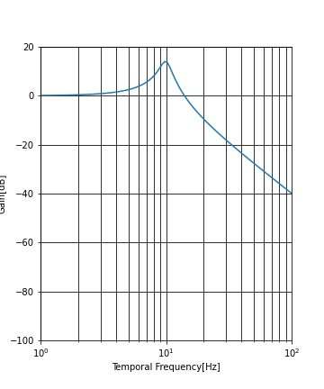
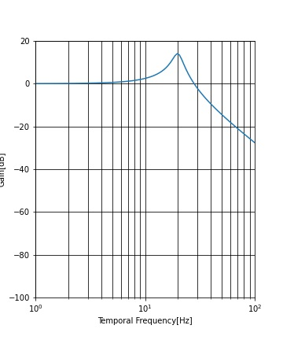

# LPF2IMGS
LPF2IMGSは、複数枚の連番画像に低域通過フィルタ（LPF）をかけ、時間的に加算した見た目を作成するPythonスクリプトです。高速な照明条件下での現象を作成するのに役立ちます。

## 依存パッケージ
---

- numpy
- opencv
- ffmpeg

## 使い方
---

1. 連番画像を用意する

    入力する連番画像を用意します。同じサイズ、形式の画像を `0.exr` ~ `360.exr`のように0から入力順に命名し作成してください。

2. LPFの設定を行う

    `settings.py`にて各種パラメータを設定することができます。

    |  名称  |  説明  |  入力形式  |
    | ---- | ---- | ---- |
    |  inputDIR  |  入力する連番画像があるディレクトリ  | String, 相対パス, 最後に/を入れない |
    |  outputDIR  |  結果を出力するディレクトリ  | String, 相対パス, 最後に/を入れない |
    |  EXT  |  画像の形式  | String, `.png` `.exr` など | 
    |  inputFreq  |  入力する連番画像全体を１周期とした場合の周波数  | float [Hz] | 
    |  encodeFPS  |  出力する連番画像のfps  | float [fps] | 
    |  renderDuration  |  出力画像の時間軸における経過時間  | float [s] | 
    |  CFF  |  時間の加算処理で想定するCFF(Critical Flicker Frequency). 定義は後述  | float [Hz] | 
    |  LPFMode  |  LPFの処理アルゴリズム指定. 移動平均法(MovingAvarage)と2次遅れ系(RLC)の２種類を実装済み.  | String, `MovingAvarage` or `RLC` | 


3. スクリプトを実行
    ```
    python LPF2IMGS.py
    ```

## LPFの仕様
---
本スクリプトでは各ピクセルの色チャンネルに対して個別にLPFを適用します。LPFの実装は２種類のアルゴリズムで行っています。

### 移動平均法
---
２次遅れ系のピクセル値に対する処理は次式で表されます。


### ２次遅れ系
---
２次遅れ系のピクセル値に対する処理は次式で表されます。


#### 周波数特性





